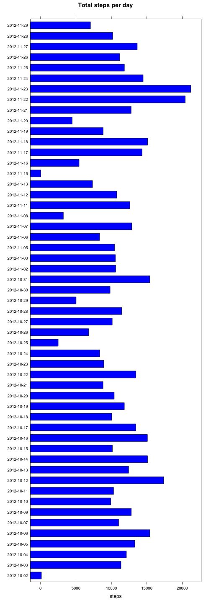
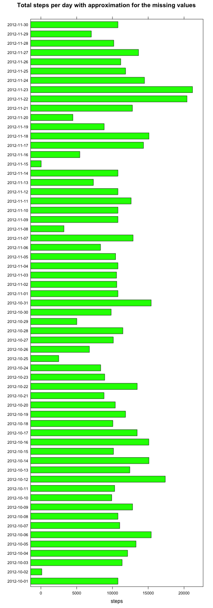
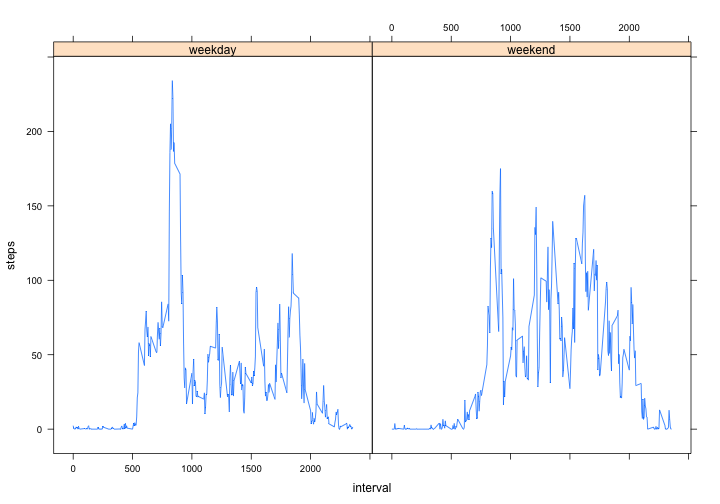

# Reproducible Research: Peer Assessment 1


## Loading and preprocessing the data


```r
# Download activity archive url:
# https://d396qusza40orc.cloudfront.net/repdata%2Fdata%2Factivity.zip unzip
# it to working directory

if (!file.exists("activity.csv")) {
    message("Activity data is not present in working directory")
}

activity = read.csv("activity.csv")  # read data for monitored activity
activity$steps = as.double(activity$steps)
activity$date = as.Date(activity$date, format = "%Y-%m-%d")
head(activity)
```

```
##   steps       date interval
## 1    NA 2012-10-01        0
## 2    NA 2012-10-01        5
## 3    NA 2012-10-01       10
## 4    NA 2012-10-01       15
## 5    NA 2012-10-01       20
## 6    NA 2012-10-01       25
```


## What is mean total number of steps taken per day?

```r
library(lattice)
stepsPerDay = aggregate(steps ~ date, activity, FUN = "sum")
barchart(date ~ steps, stepsPerDay, horizontal = T, main = "Total steps per day", 
    col = "blue")
```

 

Mean steps per day:

```r
mean(stepsPerDay$steps)
```

```
## [1] 10766
```

Median steps per day:

```r
median(stepsPerDay$steps)
```

```
## [1] 10765
```


## What is the average daily activity pattern?
Average steps per interval through all the days:

```r
stepsPerInterval = aggregate(steps ~ interval, activity, FUN = "mean")
plot(stepsPerInterval, type = "l")
```

 

Interval with the maximum steps in average:

```r
sorted = stepsPerInterval[with(stepsPerInterval, order(steps, decreasing = T)), 
    ]
sorted[1, ]
```

```
##     interval steps
## 104      835 206.2
```


## Imputing missing values

Some of the values of the steps calculated for certain interval at certain date is missing in dataset. It is represented with NA value. Here is a number of missing values:

```r
nrow(activity[is.na(activity$steps) == T, ])
```

```
## [1] 2304
```


In order to approximate missing values, it was replaced with an approximation. For approximate value at given period we take an average of the steps counted for the same period across all other days. Here is a formula used to find values with "NA" value and substitute it with approximation:

```r
activityEstimated = activity
activityEstimated[is.na(activityEstimated$steps) == T, 1] = stepsPerInterval[stepsPerInterval$interval %in% 
    activityEstimated[is.na(activityEstimated$steps) == T, 3], 2]
```


This is an histogram of the average steps per day calculated usin approximation.

```r
stepsPerDayEst = aggregate(steps ~ date, activityEstimated, FUN = "sum")
barchart(date ~ steps, stepsPerDayEst, main = "Total steps per day with approximation for the missing values", 
    col = "green")
```

 


Average steps per days with predicted values for the NaN data is 1.0766 &times; 10<sup>4</sup> while original average with  missing values was 1.0766 &times; 10<sup>4</sup>. Median for predicted and non-predicted data for the steps per day is 1.0766 &times; 10<sup>4</sup> and 1.0765 &times; 10<sup>4</sup> correspodingly.

## Are there differences in activity patterns between weekdays and weekends?


```r
activity$weekday = factor(ifelse(weekdays(activity$date) %in% c("Saturday", 
    "Sunday"), "weekend", "weekday"), c("weekday", "weekend"))

aggregatedActivity = rbind(aggregate(steps ~ interval + weekday, activity[activity$weekday == 
    "weekend", ], FUN = "mean"), aggregate(steps ~ interval + weekday, activity[activity$weekday == 
    "weekday", ], FUN = "mean"))

xyplot(steps ~ interval | weekday, aggregatedActivity, type = "l")
```

 

